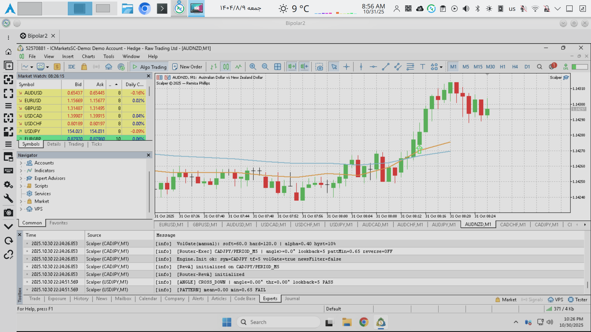

# Scalper
Forex scalper MetaTrader 5 EA working based on EMA crosses and candle pattern confirmation.

This is a Bread and Butter project. I used RevA (Revision A), you can add RevB, RevC, ...

There is an EMA on charts with Fast EMA as orange and Slow EMA as sky blue. At crosses an arrow will show you BUY or SELL. Red downward arrow => SELL. Green upward arrow => Buy.

There are dark gray arrows upward and downward. These are candle pattern confirmation arrows. If they are in the same direction of your main arrow, good, otherwise think more.

